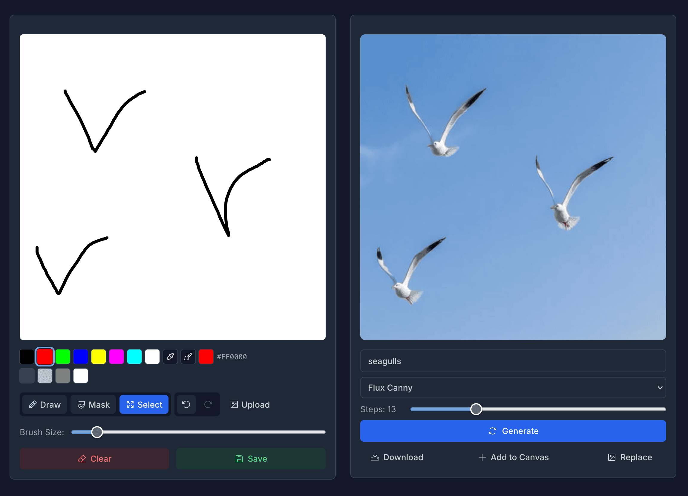
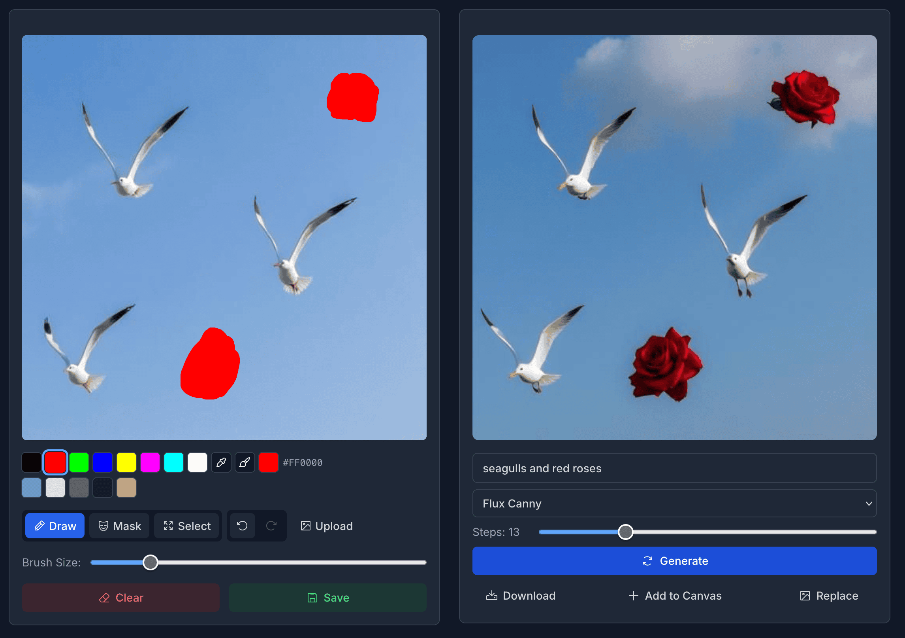
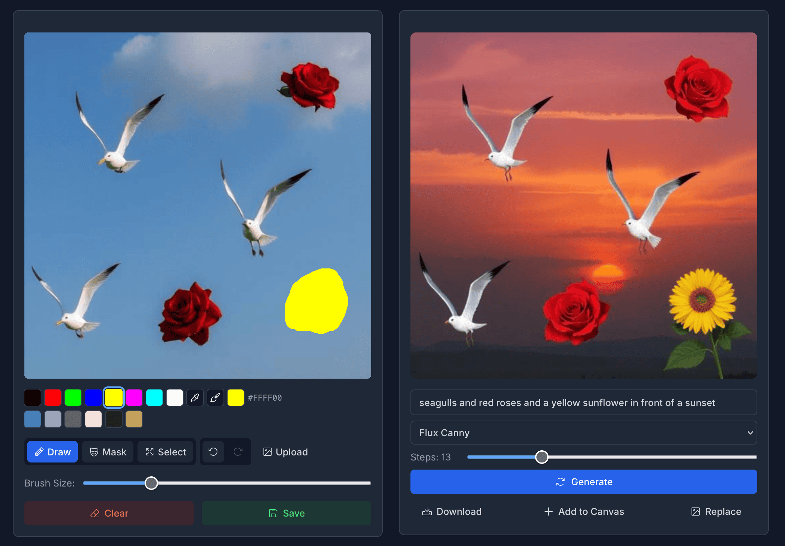

Doodle is a sketch-to-image app, built using the Flux Canny model running on [Together.ai](https://api.together.ai/models/black-forest-labs/FLUX.1-canny) and partly inspired by [Krea.ai](https://krea.ai).
The concept is simple: you make a sketch on the canvas using MS Paint like controls, then write a prompt and run the image generation model inference.

The result is typically an image that is grounded in the original sketch with look and feel determined by the model given a prompt.
Once generated, you can swap the image back to the original canvas, make more sketches, and repeat the cycle.
Through this process, you can incrementally compose an image using simple, rough sketching and prompts to steer the model to the result you have in mind.

## See it in action

Here are some screenshots showing the tool in action.
First, we draw some very rough sketches of some seagulls.
The sketch roughly determines the placement of the seagulls.
The prompt and model inference determine the rest.

From here, we replace the drawing canvas with the generated image and add some more sketches - in this case, red circles meant to represent roses.
We augment the prompt to be "seagulls with red roses" and run the model again.

Finally, we replace the drawing canvas with the generated image once more and add a yellow circle meant to represent a sunflower and augment the prompt to be "seagulls and red roses and a yellow sunflower in front of a sunset".

## Inpainting

I also experimented a bit with inpainting with the aim to add more details to the generated image in specific areas.
However, I haven't been able to find a [Flux Fill](https://huggingface.co/black-forest-labs/FLUX.1-Fill-dev) API with a low enough latency for a good user experience.
If you know of a low-latency, cost-effective way to run the Flux Fill model, please let me know!

Tech: Typescript, React, [Remix](https://remix.run/), Vercel

[Source code](https://github.com/danielcorin/doodle)
