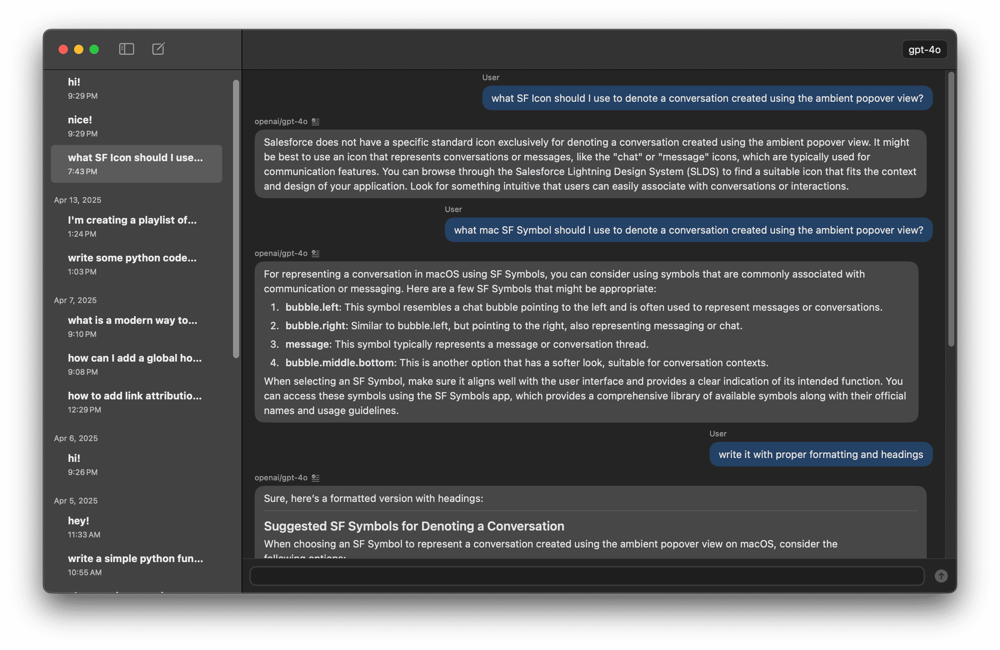

Hudson is a macOS app for simple LLM chat and conversation management.

It's a bit of a spiritual successor to [Delta](/projects/delta) though I didn't spend as much time on it and it's feature set is more minimal.

This was my first Swift project.
I used a combination of Cursor and Claude Code to write the majority of the code.
While I didn't write most of the code, I heavily managed the LLMs to ensure the code was reasonably well structured, at least based on my beginner Swift knowledge.

I was going to implement model switching, but decided to pivot to a different concept, more focused on quick conversations and image/screenshot support.

## Features

- Hotkey support
- Markdown rendering and toggle to raw text
- Realtime token streaming

Tech: Swift, SwiftUI, Xcode
