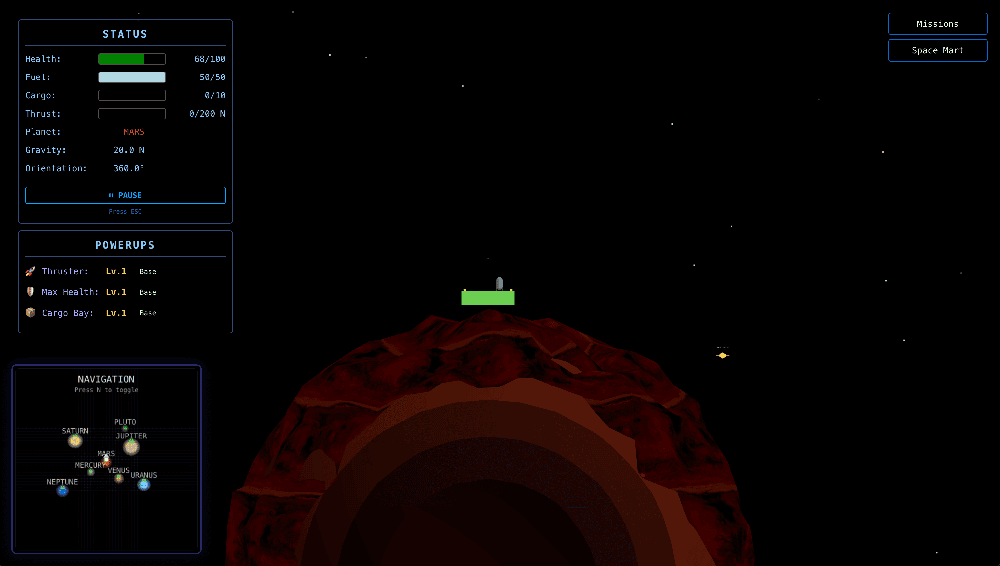
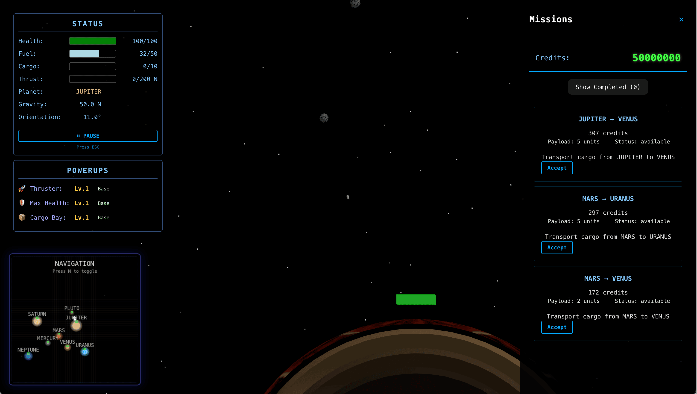

"Pad Lander" is a game I started working on when I saw some people posting about building games with LLM coding assistants.
It seemed like something that would be fun to try and I fully embraced a vibe code and verification approach to the project.
This approach was fun, but quickly became a lot less fun when I hit a point of no return, where neither I nor the LLM could dig us out of the hole we created.

I never quite got to a point I felt was finished, but at some point I hope to find the time to pick back up and revisit the project.

The game aims to be a sort of cross between [Motherload](https://www.play-games.com/game/20381/motherload.html) and [Gravity](https://www.youtube.com/watch?v=XiPAn9eS_T8), two games I enjoyed a lot as a kid.

Features I built out before the vibe coding quick sand caught me:

- Varied gravity between planets
- Fuel system
- Collision detection and health system
- Powerups and a mart to increase health, fuel, thruster power, cargo bay size
- A mission system to transport cargo between planets for credits to use to buy powerups at the mart
- Random asteroids between planets

## Takeaways

While the project didn't end up as I'd planned, this was one of the most fun things I've worked on in a while.
It's the game I wish I could have worked on growing up (even though the tech was hardly there at the time).
While previously I had not been motivated enough to invest time in developing the skills to code a game like this, I've always had the vague idea to build something like it.
I feel fortunate to have had the opportunity to operate at a level I hadn't previously thought was achievable given the time I had to commit to the project.
I know with confidence I would not have found the time to put in the needed effort to get this far without LLM assistance.

Tech: Vite, React, [Three.js](https://threejs.org/), [React-Three-Fiber](https://r3f.docs.pmnd.rs)
