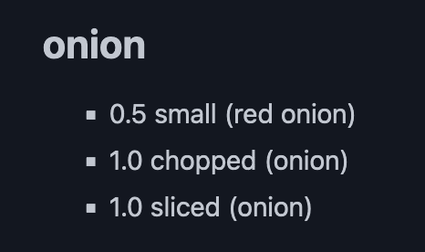
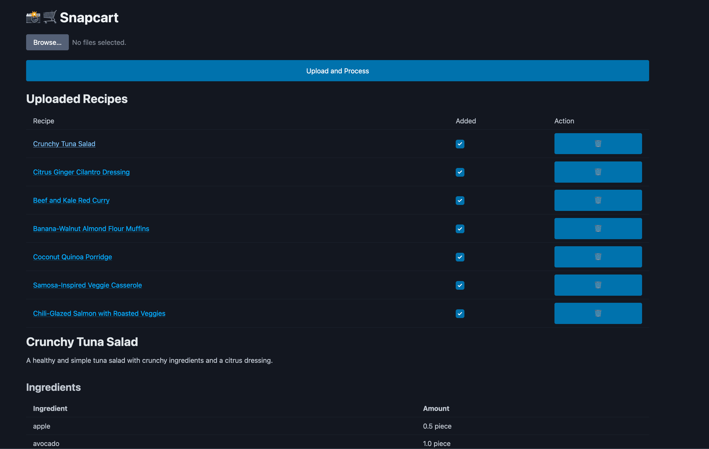

## The app

I built Snapcart to help my wife and I easily create a shopping list for recipes across several, physical recipe books.
You take and upload a picture of ingredient list from a recipe and the app extracts the ingredients list and quantities with `gpt-4o`'s vision capabilities.
Once you've uploaded all the recipes you want to purchase ingredients for, you create a shopping list.
To do this, the app uses a language model that creates high level categories for similar items then groups them all together to make it easy to get everything you need for multiple recipes when shopping.
For example:

## Challenges

This was a bit challenging at times because the model tends to hallucinate ingredients if the photo of the ingredient list isn't a very good one.
With a bit of care in photo taking, it seemed to be working quite well.

This was another project I built to learn `fasthtml`.
I ran into more challenges using the framework with this approach because of the latency needed to process and extract ingredients from the recipe ingredient list images, which leads the entire site to hang until the request returns.
Processing these off thread or only returning html for the updated section of the site (as the framework recommends) could have probably helped with this issue but I'm still in a React mindset when it comes to frontend so I haven't quite gotten there yet with the project.

Tech: Python, [FastHTML](https://fastht.ml/), [Railway](https://railway.app/), gpt-4o

