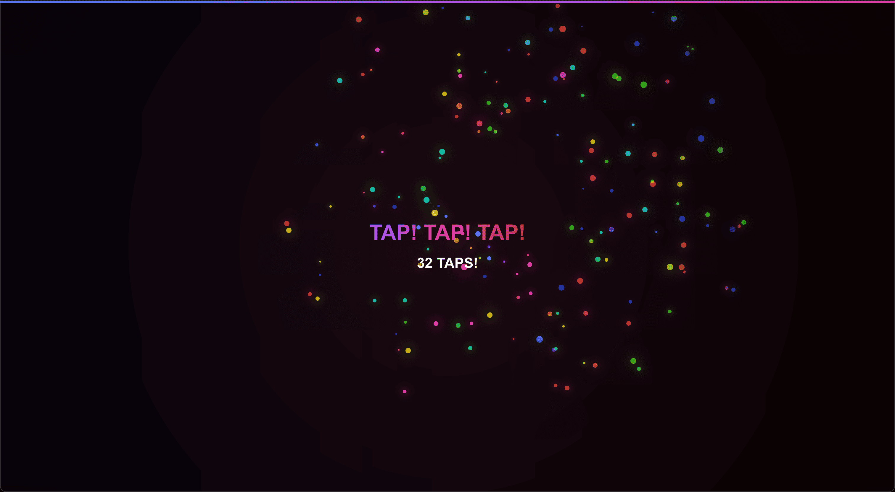

[Tapfast](https://tapfast.vercel.app/) was conceived shortly after the much cooler and more interesting [Stimulation Clicker](https://neal.fun/stimulation-clicker/) was released by Neal.
After a friend bragged to me about their superior clicks per second, I decided to make a game that could measure that.
They current hold highest known score of 337.

Since the game registers up to 5 taps simultaneously, it's actually easier to score well on a device with a touch screen.

Originally, the game had much more involved and exciting graphics but they interfered with the ability to actually count the taps.
I simplified the visuals so I could have a playable version complete in around an hour.

All the code was written with `claude-3-5-sonnet-20241022` and Cursor.

Tech: React, Next.js, Vercel

