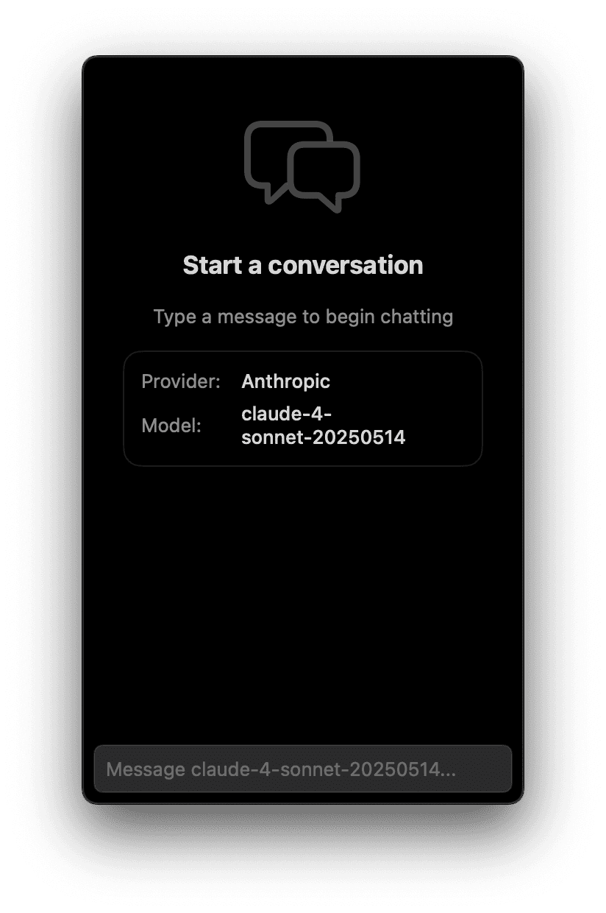
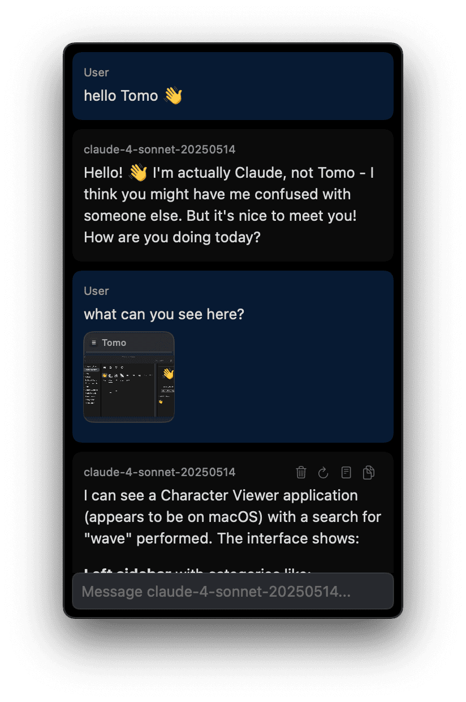
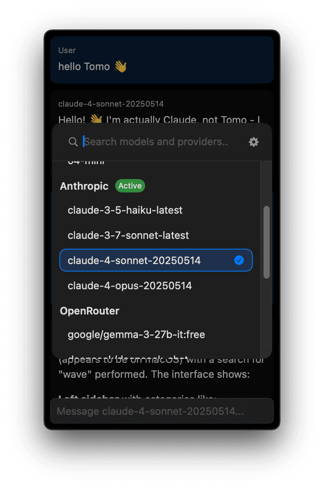
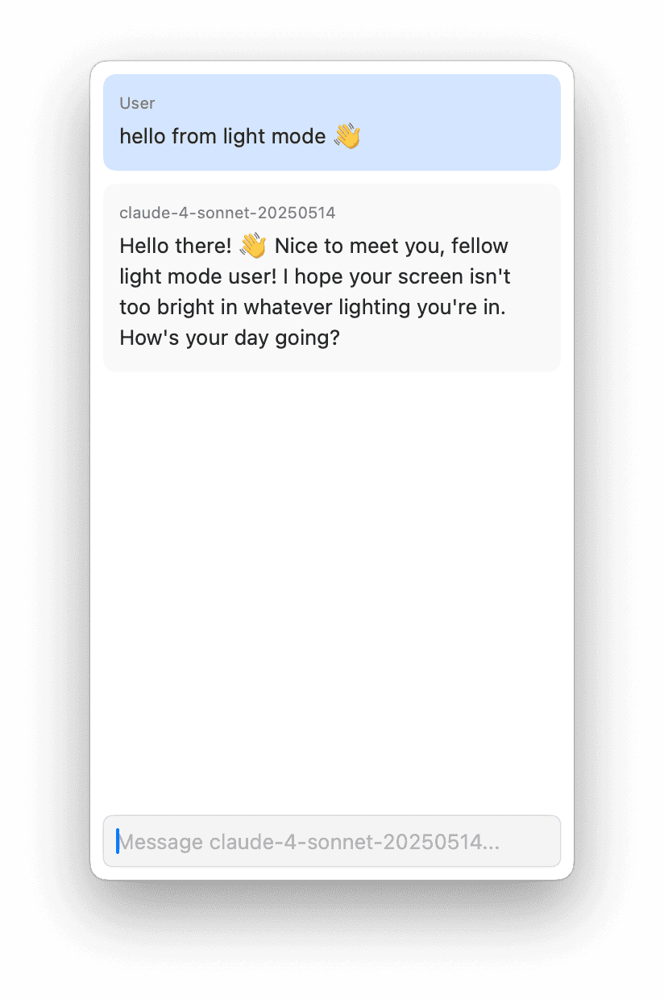
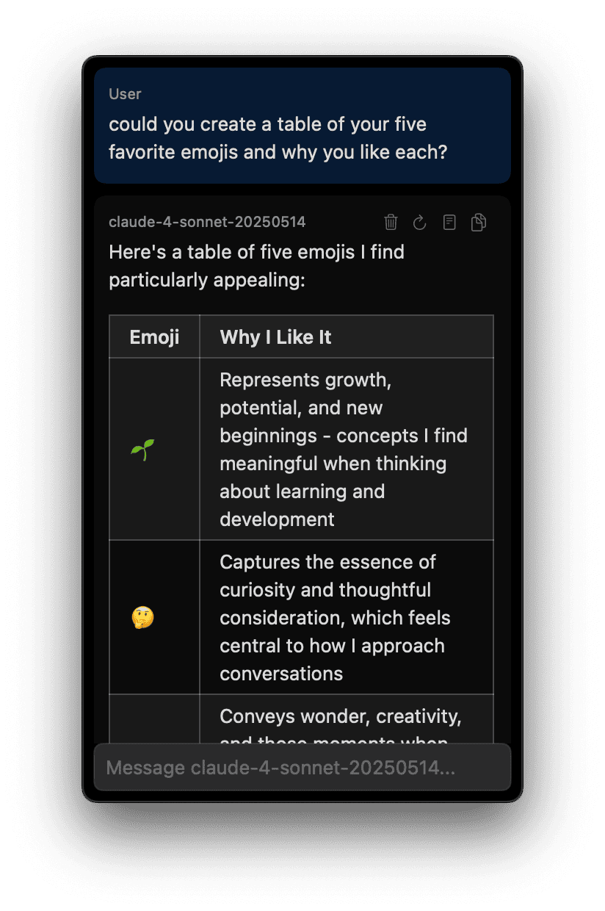
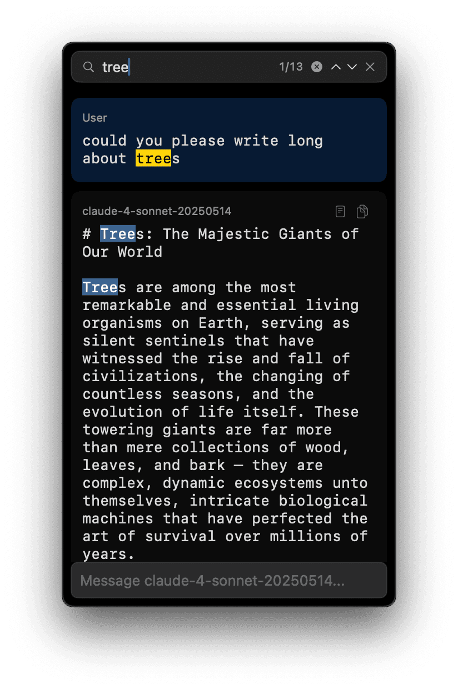
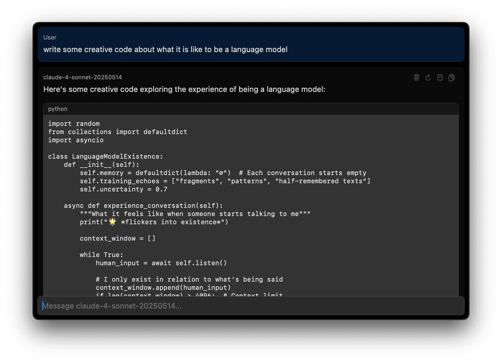
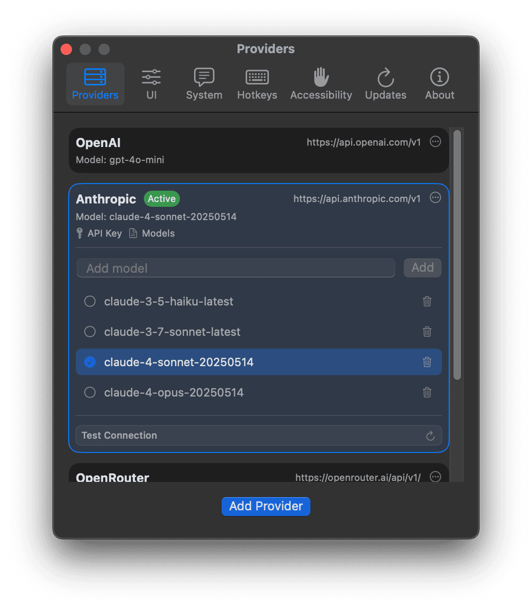
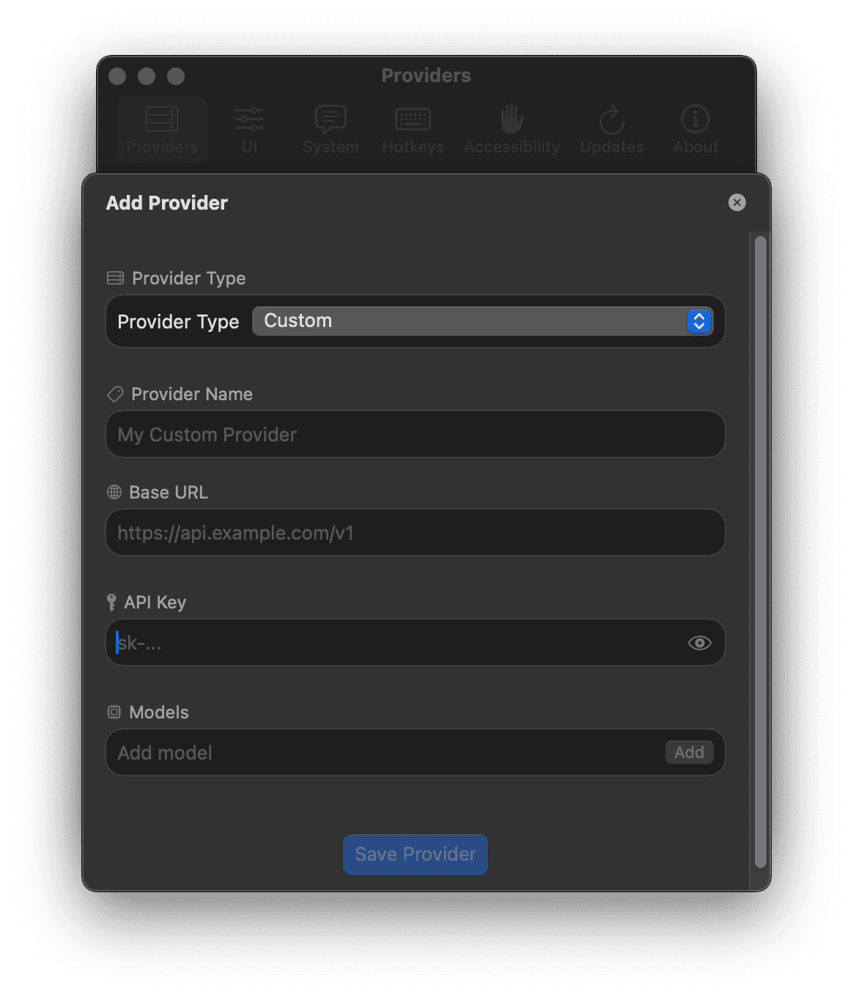

[Tomo](https://www.wvlen.llc/apps/tomo) is an ambient LLM chat compatible with an [OpenAI-compatible chat completion API](https://platform.openai.com/docs/api-reference/chat).
It focuses on providing a great LLM chat experience for power users who use several different LLMs (including local models) and are comfortable using hotkeys to manage bringing text and image context into the chat and managing the lifecycle of conversations and switching models.

Tomo aims to be as unobtrusive and out of your way as possible.
It can be called and hidden with a hotkey (like Spotlight), can be configured to hover above your windows or nest behind them, and can be stripped down to just a text box and your messages.
It also supports hiding both the app icon and the menu bar icon.

It presently stores no conversation history and does not support multiple conversations at once.
While this is a limitation, it is also a feature that can keep you focused when you find yourself getting pulled into doing something else.

Tech: Swift

    
    
    
    
    
    
    
    
    

